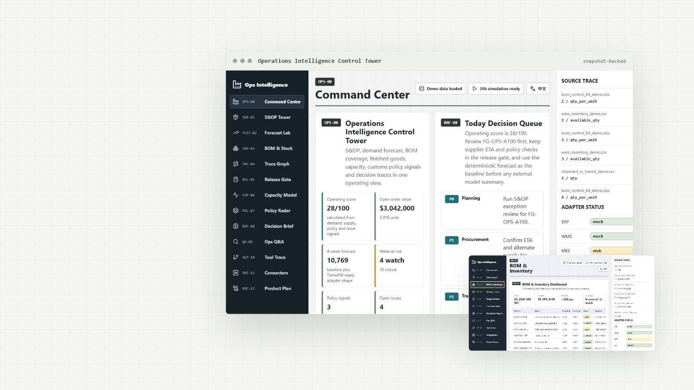

# Operations Intelligence Platform

[](https://github.com/Felix-Zuo/factory-ops-intelligence-platform/actions/workflows/ci.yml)
[](https://github.com/Felix-Zuo/factory-ops-intelligence-platform/releases/latest)
[](LICENSE)

[](https://felix-zuo.github.io/factory-ops-intelligence-platform/showcase.html)

Know what can ship, what is blocked, and which evidence supports the next action.

[Live product page](https://felix-zuo.github.io/factory-ops-intelligence-platform/showcase.html) · [Quick start](#quick-start) · [API](apps/api-server/factory_ops_api/main.py) · [v0.3.3 release](RELEASE_NOTES_v0.3.3.md)

This repository is a runnable, local-first public demo. It joins demand, BOM and inventory coverage, finished-goods position, inbound supply, capacity simulation, policy signals, release controls and source-linked tool traces. All checked-in records are synthetic; live ERP, WMS, MES and model integrations remain explicit mock, sample or stub boundaries.

<details>
<summary>中文概览</summary>

这是一个可本地运行的通用运营智能平台演示，覆盖需求、BOM 与库存、成品、在途供应、产能仿真、政策信号、放行控制和可追溯工具调用。仓库只包含合成数据；ERP、WMS、MES 及模型连接均明确标注为 mock、sample 或 stub。

</details>

## What It Demonstrates

| Capability | Evidence in this repo |
|---|---|
| S&OP control tower | `build_control_tower_overview`, `demo_data/demand_history.json`, `demo_data/product_economics.json` |
| Forecast and model adapter boundary | `forecast_demand`, TimesFM-ready time-series contract, `GET /api/forecast/demand` |
| External policy radar | `demo_data/policy_signals.json`, `search_policy_signals`, official-source adapter contract |
| Decision brief | `generate_decision_brief`, owner/action/evidence lanes, deterministic-tool-first model boundary |
| Release gate workbench | `build_release_gate`, material/capacity/policy/quality/source/approval checks, `GET /api/release-gates/{order_id}` |
| Scenario profile library | `demo_data/scenario_profiles.json`, reusable assembly, fulfillment, service-kit and quality-lab operating profiles |
| Spreadsheet and export intake | `demo_data/file_imports.json`, parser labels, import dashboard |
| BOM and material readiness | BOM explosion, inventory coverage, source-row trace |
| Release notice generation | HTML/JSON notice preview from order, product and material gate |
| Line takt and bottleneck analysis | Deterministic 24h simulation over configurable machine nodes |
| Source-linked operations tools | Tool registry, bounded workflow routing, tool calls and source refs |
| Declared integration boundaries | ERP/WMS/MES/PLC/scheduling/MCP mock, sample or stub contracts |

## Default Scenario

The main scenario follows `FG-OPS-A100`, a synthetic modular control kit. The wider data pack also includes a sensor pack, fluid service kit and inspection fixture so the model is not tied to one product category.

Reusable scenario profiles live in `demo_data/scenario_profiles.json`:

- `manufacturing-assembly`: demand to material gate, capacity, release and trace.
- `warehouse-fulfillment`: order promise, pick readiness, carrier plan and shipment release.
- `maintenance-kit`: service demand, kit completeness, vendor ETA and dispatch gate.
- `quality-lab`: sample intake, test capacity, hold decision and release evidence.

```text
demo_data
  -> parser and seed scripts
  -> SQLite demo database
  -> deterministic domain engines
  -> FastAPI operations API
  -> generated frontend snapshot
  -> React operations console
  -> agent tool registry and workflow trace
```

## Quick Start

Requirements:

- Python 3.11+
- Node.js 20.19+ or 22+

```powershell
git clone https://github.com/Felix-Zuo/factory-ops-intelligence-platform.git
cd factory-ops-intelligence-platform
python -m pip install -r apps/api-server/requirements.txt
npm --prefix apps/web-dashboard install
python scripts/seed_demo_data.py
python scripts/generate_frontend_snapshot.py
```

Start the API:

```powershell
$env:PYTHONPATH="apps/api-server"
python -m uvicorn factory_ops_api.main:app --host 127.0.0.1 --port 8017
```

Start the dashboard:

```powershell
npm --prefix apps/web-dashboard run dev -- --host 127.0.0.1 --port 5178
```

Or start both services:

```powershell
.\scripts\run_dev.ps1
```

Run the full validation suite:

```powershell
npm run test:all
```

The full check seeds demo data, regenerates the frontend snapshot, runs self-checks, runs pytest, runs the smoke demo, scans user-facing copy, verifies the static showcase page and builds the web dashboard.

## Product Evidence

The live page uses real dashboard captures, while this table points each public claim to its current implementation and verification path:

| Surface | What it proves | Primary files |
|---|---|---|
| Control tower | Demand, open order value, forecast, material risk, policy signals and decision queue come from one generated snapshot. | `apps/api-server/factory_ops_api/domain.py`, `scripts/generate_frontend_snapshot.py`, `apps/web-dashboard/src/App.tsx` |
| Release gate | Material, capacity, policy, quality, source trace and human approval checks are combined before notice export. | `apps/api-server/factory_ops_api/domain.py`, `apps/api-server/factory_ops_api/main.py`, `tests/test_factory_ops.py` |
| Trace graph | Product, BOM, stock, inbound shipment, supplier and source-row references stay linked. | `apps/api-server/factory_ops_api/domain.py`, `demo_data/*.json`, `tests/test_factory_ops.py` |
| Capacity model | 24h line simulation exposes output, utilization, waiting, blocking and bottleneck signals. | `apps/api-server/factory_ops_api/domain.py`, `tests/test_factory_ops.py` |
| Tool trace | Natural-language questions call deterministic tools first and keep source refs visible. | `apps/api-server/factory_ops_api/domain.py`, `agent_workspace/workflows`, `tests/test_factory_ops.py` |

<details>
<summary>Detailed screen captures</summary>

- [BOM and inventory gate](docs/assets/screenshots/material-risk.png)
- [Release package](docs/assets/screenshots/notice-page.png)
- [Material trace graph](docs/assets/screenshots/product-material-trace.png)
- [Line simulation](docs/assets/screenshots/simulation-page.png)
- [Operations Q&A](docs/assets/screenshots/ai-factory-qa.png)
- [Integration status](docs/assets/screenshots/integration-status.png)

</details>

## Runtime Modules

| Module | Current behavior |
|---|---|
| S&OP Control Tower | Open demand, 4-week forecast, finished-goods cover, material gate, capacity, value and action status |
| Forecast Lab | Deterministic demand forecast with TimesFM-ready interface shape |
| Policy Radar | Official-source customs/policy signals linked to materials, products and orders |
| Decision Brief | Source-backed actions, evidence lanes and model safety boundary |
| Release Gate | Combines material, capacity, policy, quality, source-trace and human approval controls before notice export |
| Scenario Profiles | Shows reusable operating profiles for manufacturing, fulfillment, service parts and quality review |
| Data Import Center | Classifies demo files, parser status, source rows and quality flags |
| BOM & Inventory | Explodes BOM demand into material coverage, inbound records, supplier notes and shortage watch |
| Product Material Trace | Links product, BOM, stock, inbound, order, supplier and source refs |
| Release Notice Generator | Builds a notice preview from product, order, BOM, material gate and template version |
| Line Simulation | Runs deterministic 24h output, utilization, waiting, blocking, scrap and bottleneck checks |
| Simulation Report | Summarizes line output, bottleneck, quality risk and machine-level metrics |
| Operations Q&A | Selects intent and workflow, calls registered tools and returns source-backed output |
| Integration Status | Shows ERP/WMS/MES/PLC/scheduling/MCP mode and current gaps |
| Agent Trace | Shows tool calls, inputs, source refs and execution order |

## Architecture

```text
apps/api-server         FastAPI operations API
apps/web-dashboard      React operations console
apps/api-server/factory_ops_api/domain.py
                        Current deterministic domain implementation
packages/*              Documented extraction boundaries for future modules
demo_data               Synthetic manufacturing records
database                SQLite schema and seed target
tests                   Domain, API, trace and snapshot checks
scripts                 Seed, smoke, tone scan, snapshot and validation
```

The dashboard can run from a generated snapshot, so reviewers can inspect the UI without keeping the API process alive. The package folders describe intended module boundaries; public capability claims point to the implementation that exists today in `domain.py` and `main.py`.

## Project History

This repository is an independent public demo that consolidates several operation-tooling directions:

- spreadsheet export intake and standardized records;
- release notice generation from a structured order payload;
- line takt simulation and bottleneck reporting;
- manufacturing data-model examples for BOM, stock, supplier and traceability;
- S&OP control-tower modeling for demand, stock, capacity, policy and cash;
- forecast interface design compatible with TimesFM-style time-series models;
- official-source external signal adapters for customs and policy changes;
- release-gate governance across material, capacity, quality, policy, traceability and approval;
- reusable scenario profiles for non-single-category operations demos;
- source-backed agent workflows with tool-call evidence.

See [PROJECT_HISTORY.md](PROJECT_HISTORY.md) for the detailed capability map and release trail.

## Public Data Boundary

Keep production exports, customer lists, supplier lists, real BOMs, shipment plans, screenshots with company identifiers and logs out of the repository unless they have been intentionally sanitized.

Live integrations are represented by mock/stub/sample adapters. Credentials and live system URLs do not belong in this repo.

## Documentation

- [Project history](PROJECT_HISTORY.md)
- [Architecture](ARCHITECTURE.md)
- [Data contract](DATA_CONTRACT.md)
- [Demo script](DEMO_SCRIPT.md)
- [Roadmap](ROADMAP.md)
- [Product requirements](PRODUCT_REQUIREMENTS.md)
- [Technical analysis](TECHNICAL_ANALYSIS.md)
- [Quality standard](QUALITY_STANDARD.md)
- [Release notes v0.3.3](RELEASE_NOTES_v0.3.3.md)
- [Release notes v0.3.2](RELEASE_NOTES_v0.3.2.md)
- [Release notes v0.3.1](RELEASE_NOTES_v0.3.1.md)
- [Release notes v0.3.0](RELEASE_NOTES_v0.3.0.md)
- [Changelog](CHANGELOG.md)
- [Contributing](CONTRIBUTING.md)
- [Security](SECURITY.md)

## License

MIT. See [LICENSE](LICENSE).
