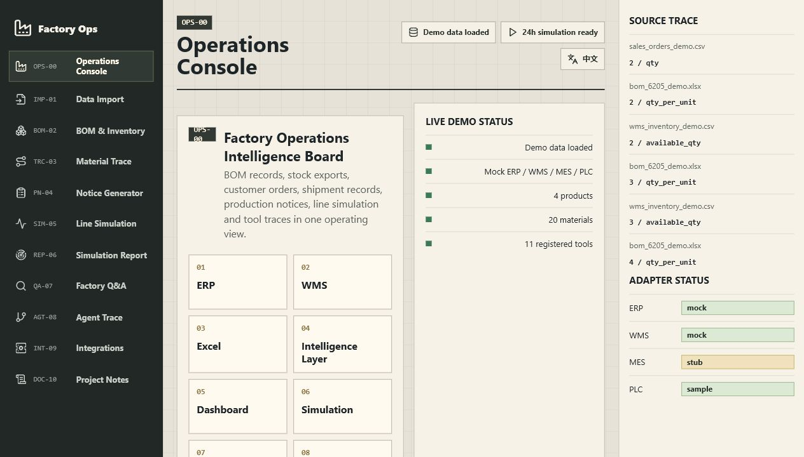
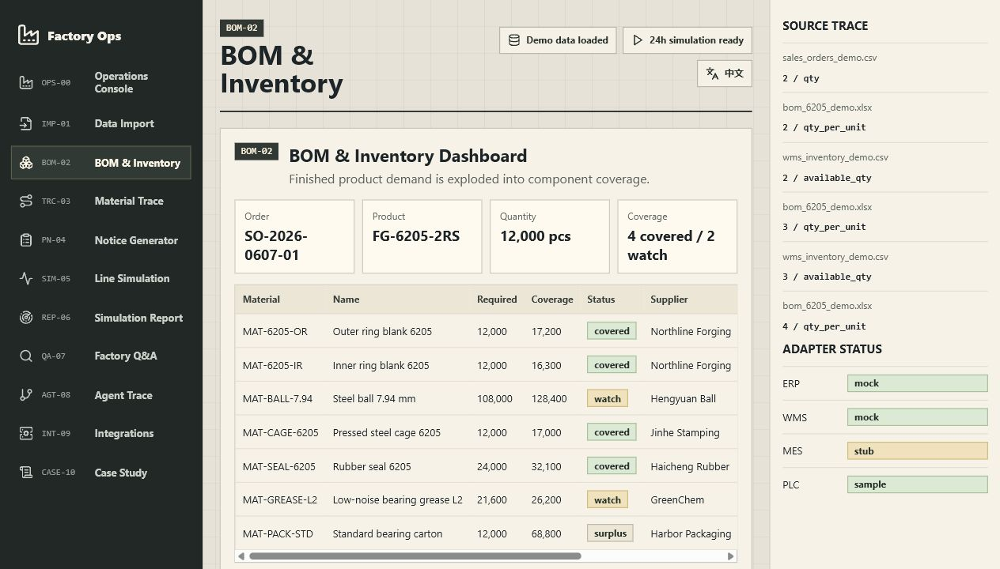
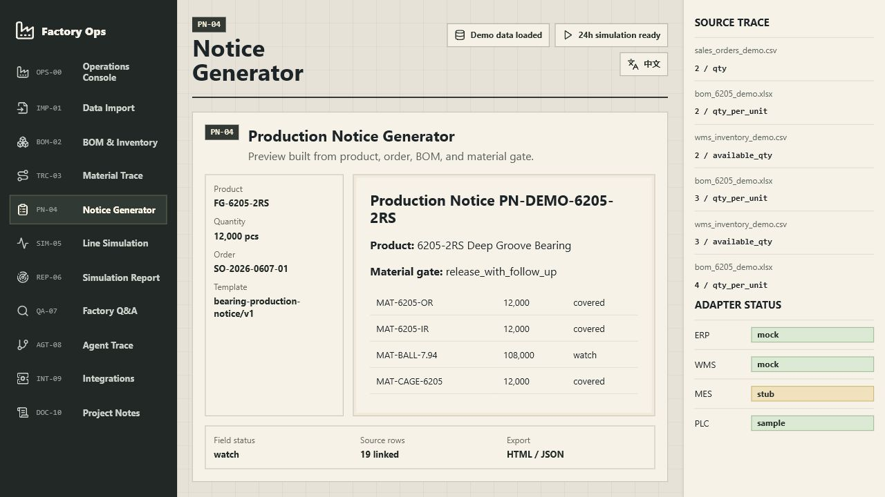
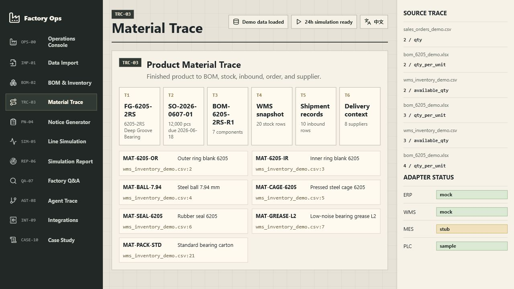
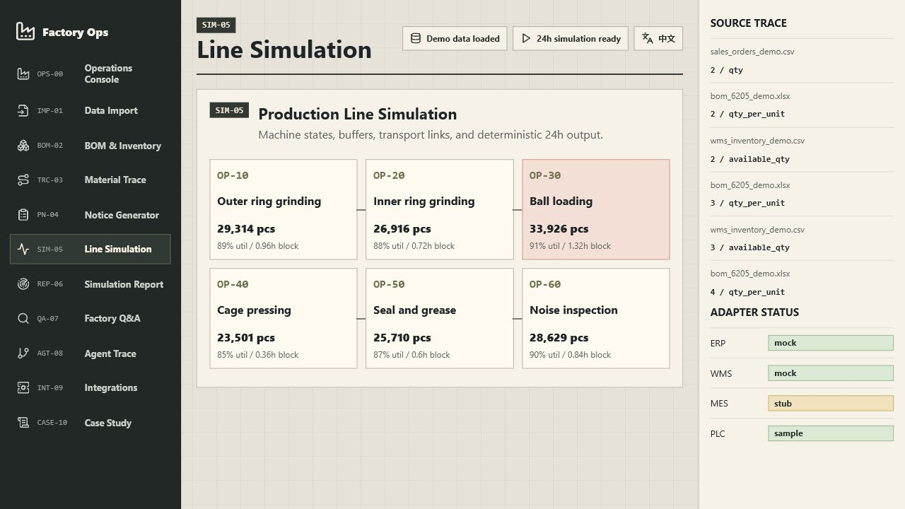
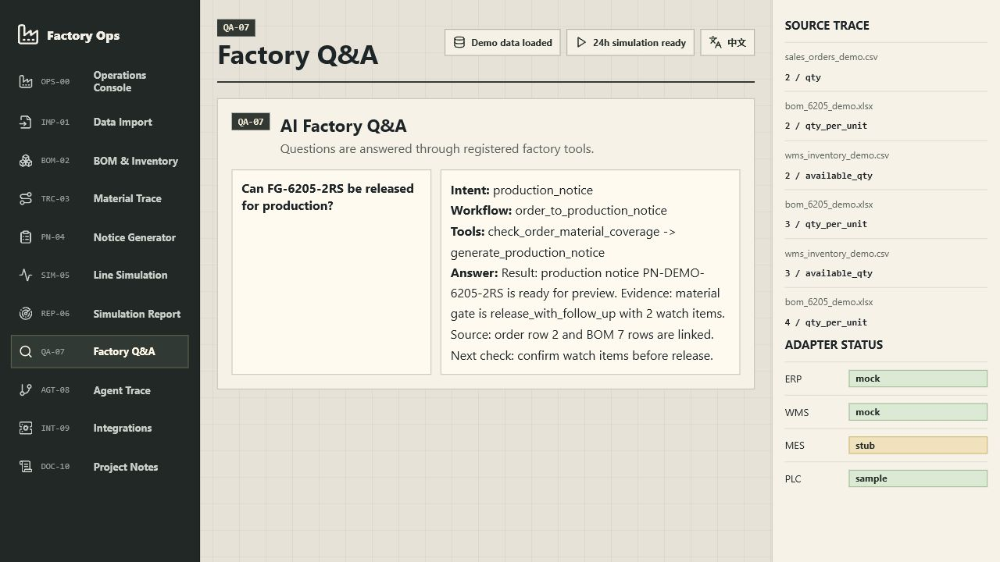
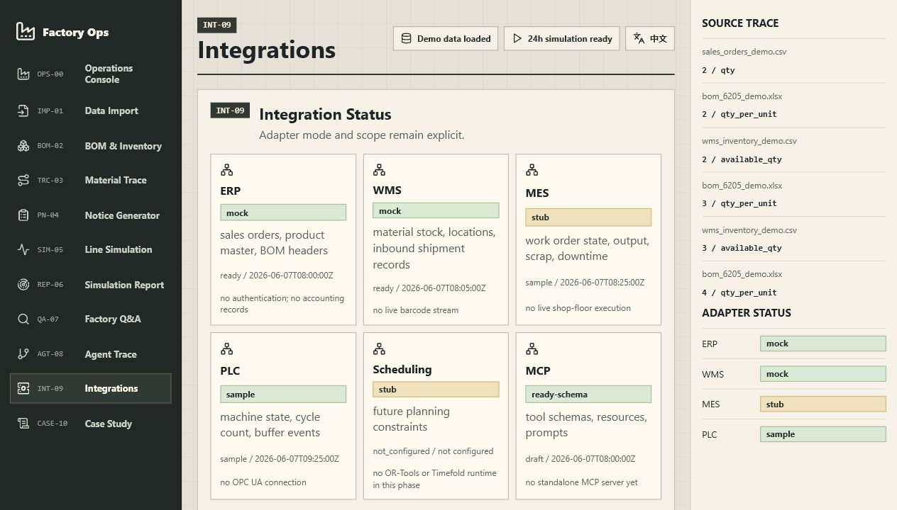

# AI Factory Operations Intelligence Platform

[](https://github.com/Felix-Zuo/factory-ops-intelligence-platform/actions/workflows/ci.yml)


A demo-ready operations intelligence layer for fragmented manufacturing data.

This project connects BOM records, inventory exports, customer orders, shipment data, production notices, line simulation results, and agent tool calls into a single manufacturing operations prototype. It is built for local reproduction, technical review, and extension through parsers, adapters, deterministic engines, and tool-oriented agent workflows.

Showcase page: [docs/showcase.html](docs/showcase.html)



## Why This Exists

Manufacturing teams often make release decisions from separate ERP exports, WMS stock files, spreadsheet BOMs, supplier updates, production notice templates, and line assumptions. This repository models that operating loop with synthetic demo data and explicit mock/stub adapters so the workflow can be inspected without private factory systems.

中文摘要：这个项目把 BOM、库存、客户订单、在途记录、生产通知单、产线仿真、接口状态和工具调用轨迹放进同一个可复现的制造业运营 demo 中。公开版本只使用合成数据和 mock/stub 接口。

## Quick Start

Requirements:

- Python 3.11+
- Node.js 20+

```powershell
git clone https://github.com/Felix-Zuo/factory-ops-intelligence-platform.git
cd factory-ops-intelligence-platform
python -m pip install -r apps/api-server/requirements.txt
npm --prefix apps/web-dashboard install
python scripts/seed_demo_data.py
python scripts/generate_frontend_snapshot.py
```

Start the API:

```powershell
$env:PYTHONPATH="apps/api-server"
python -m uvicorn factory_ops_api.main:app --host 127.0.0.1 --port 8017
```

Start the dashboard:

```powershell
npm --prefix apps/web-dashboard run dev -- --host 127.0.0.1 --port 5178
```

Or start both services:

```powershell
.\scripts\run_dev.ps1
```

Run the full validation suite:

```powershell
npm run test:all
```

The full check seeds demo data, regenerates the frontend snapshot, runs self-checks, runs pytest, runs the smoke demo, scans user-facing copy, and builds the web dashboard.

## Demo Flow

```text
demo_data
  -> parser and seed scripts
  -> SQLite demo database
  -> deterministic domain engines
  -> FastAPI operations API
  -> generated frontend snapshot
  -> React engineering console
  -> agent tool registry and workflow trace
```

The default scenario follows finished product `FG-6205-2RS` through BOM explosion, material coverage, stock risk, production notice generation, 24 hour line simulation, bottleneck reporting, and tool-backed factory Q&A.

## Screenshots

| BOM and inventory | Production notice |
|---|---|
|  |  |

| Material trace | Line simulation |
|---|---|
|  |  |

| Factory Q&A | Integration status |
|---|---|
|  |  |

## What Runs Today

| Module | Current behavior |
|---|---|
| Data Import Center | Classifies demo files, parser status, source rows, and quality flags |
| BOM & Inventory | Explodes BOM demand into material coverage, inbound records, supplier notes, and shortage watch |
| Product Material Trace | Links finished product, BOM, stock, inbound, order, supplier, and source refs |
| Production Notice Generator | Builds a notice preview from product, order, BOM, material gate, and template version |
| Line Simulation | Runs deterministic 24 hour output, utilization, waiting, blocking, scrap, and bottleneck checks |
| Simulation Report | Summarizes line output, bottleneck, quality risk, and machine-level metrics |
| Factory Q&A | Selects intent and workflow, calls registered tools, and returns source-backed output |
| Integration Status | Shows ERP/WMS/MES/PLC/scheduling/WeChat/MCP mode and current gaps |
| Agent Trace | Shows tool calls, inputs, source refs, and execution order |

## Architecture

```text
apps/api-server         FastAPI operations API
apps/web-dashboard      React engineering console
packages/core-domain    Shared domain boundary
packages/parsers        Import parser boundary
packages/engines        Deterministic calculation boundary
packages/integrations   Adapter contracts
packages/agent-runtime  Tool registry and trace boundary
demo_data               Synthetic manufacturing records
database                SQLite schema and seed target
tests                   Domain, API, trace and snapshot checks
scripts                 Seed, smoke, tone scan, snapshot and validation
```

The dashboard can run from a generated snapshot, so reviewers can inspect the UI without keeping the API process alive. Backend functions still produce the same values used by the smoke demo and tests.

## Agent Runtime

The agent layer is tool-backed. It selects an intent, runs a workflow, calls registered tools, returns tool output, and exposes source references.

Registered tools:

- `search_material`
- `get_product_bom`
- `explode_bom`
- `calculate_inventory_risk`
- `check_order_material_coverage`
- `generate_production_notice`
- `run_line_simulation`
- `get_simulation_report`
- `detect_bottleneck`
- `generate_daily_report`
- `answer_factory_question`

## Mock / Stub Boundaries

| Adapter | Demo mode | Boundary |
|---|---|---|
| ERP | mock | Orders, product master, BOM headers, work-order-shaped payloads |
| WMS | mock | Inventory export, stock location, inbound quantity |
| MES | stub | Production notice handoff and execution status shape |
| PLC | sample | Machine events, cycle counts, utilization, waiting, blocking, scrap |
| Scheduling | stub | Adapter contract only; no optimization solver in this release |
| WeChat | webhook mock | Message-in and answer-out concept only |
| MCP / Agent | schema-ready mock | Tool schemas, source refs, workflow trace |

## Extending The Project

- Add a parser in `packages/parsers/` and map it into `scripts/seed_demo_data.py`.
- Add synthetic records under `demo_data/` and update `database/schema.sql` when a new table is needed.
- Add deterministic calculations in the API/domain layer before exposing them to the agent runtime.
- Add an adapter contract under `packages/integrations/` and mark whether it is `mock`, `stub`, or `sample`.
- Add an agent tool schema in `agent_workspace/tool_registry.json`, then cover it in tests and the smoke demo.
- Regenerate the dashboard snapshot with `python scripts/generate_frontend_snapshot.py`.

## Documentation

- [Architecture](ARCHITECTURE.md)
- [Data contract](DATA_CONTRACT.md)
- [Demo script](DEMO_SCRIPT.md)
- [Roadmap](ROADMAP.md)
- [Release notes](RELEASE_NOTES_v0.1.0.md)
- [Contributing](CONTRIBUTING.md)
- [Security](SECURITY.md)

## Roadmap

- Add more import profiles for production notice and inventory exports.
- Add a versioned notice-template registry with approval state.
- Expand adapter examples for ERP, WMS, MES, PLC, and MCP.
- Add visual regression checks for the dashboard and showcase page.
- Add optional scheduling experiments behind the existing scheduling adapter boundary.

## License

MIT. See [LICENSE](LICENSE).

