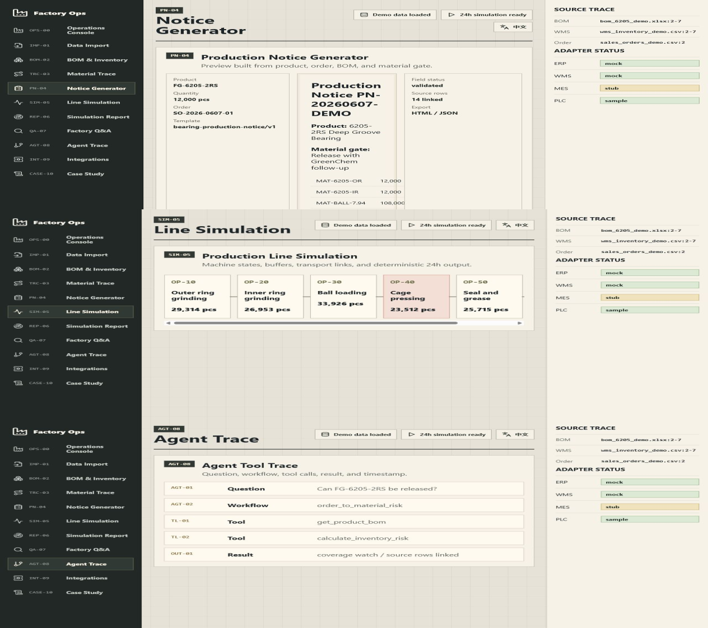

# AI Factory Operations Intelligence Platform

A demo-ready operations intelligence layer for fragmented manufacturing data.


## English

Factory teams often compare BOM, WMS stock, customer orders, inbound shipments, supplier delivery notes, production notice templates, and line assumptions across separated files. This repository connects those records into one traceable prototype.

The demo follows `FG-6205-2RS` through material coverage, production release, 24h line simulation, and agent tool trace.

## Core Modules

| Module | What it shows |
|---|---|
| Data Import Center | File classification, parsing status, source rows |
| BOM & Inventory Dashboard | Component demand, stock coverage, inbound records, supplier status |
| Product Material Trace | Finished product -> BOM -> stock -> inbound -> order -> supplier |
| Production Notice Generator | Notice preview from product, order, BOM, and material gate |
| Production Line Simulation | Machine states, transfer links, 24h throughput, bottleneck |
| AI Factory Q&A | Tool-backed response with trace and source evidence |
| Integration Status | ERP/WMS/MES/PLC/WeChat/MCP mock or stub mode |


## 中文

工厂运营经常需要在 BOM、WMS 库存、客户订单、在途记录、供应商交付、生产通知单模板和现场节拍假设之间来回核对。这个仓库把这些记录连接成一个可追溯的运营智能原型。

演示围绕 `FG-6205-2RS` 展开：物料覆盖、生产放行、24 小时产线仿真和 Agent 工具轨迹。

## 项目模块

| 模块 | 展示内容 |
|---|---|
| 数据导入中心 | 文件分类、解析状态、来源行 |
| BOM 与库存看板 | 组件需求、库存覆盖、在途记录、供应商状态 |
| 成品物料追溯 | 成品 -> BOM -> 库存 -> 在途 -> 订单 -> 供应商 |
| 生产通知单生成器 | 基于成品、订单、BOM 和物料放行状态生成预览 |
| 产线节拍仿真 | 设备状态、传送连接、24 小时产量、瓶颈 |
| 工厂运营问答 | 带工具轨迹和来源证据的回答 |
| 接口状态 | ERP/WMS/MES/PLC/微信/MCP 的 mock 或 stub 模式 |



## Architecture

```text
demo_data
  -> deterministic domain engines
  -> FastAPI operations API
  -> React engineering console
  -> agent_workspace tools and workflows
```

## Quick Start

```powershell
git clone https://github.com/Felix-Zuo/factory-ops-intelligence-platform.git
cd factory-ops-intelligence-platform
python -m pip install -r apps/api-server/requirements.txt
npm --prefix apps/web-dashboard install
python scripts/seed_demo_data.py
```

Start API:

```powershell
$env:PYTHONPATH="apps/api-server"
python -m uvicorn factory_ops_api.main:app --host 127.0.0.1 --port 8017
```

Start dashboard:

```powershell
npm --prefix apps/web-dashboard run dev -- --host 127.0.0.1 --port 5177
```

Validate:

```powershell
python scripts/self_check.py
python -m pytest tests
python scripts/smoke_demo.py
python scripts/check_ai_tone.py
npm --prefix apps/web-dashboard run build
```

## Agent Runtime

The agent layer exposes tool contracts for material coverage, production notice generation, line simulation, bottleneck detection, daily reporting, and factory Q&A. The default provider is a mock runtime so the demo stays reproducible without live credentials.

## Adapter Design

ERP, WMS, MES, PLC, WeChat, and MCP are represented as adapter-ready contracts. The public demo uses synthetic data and mock/stub statuses.

## Related Showcase Projects

- [factory-excel-ops-dashboard](https://github.com/Felix-Zuo/factory-excel-ops-dashboard)
- [factory-production-notice-agent](https://github.com/Felix-Zuo/factory-production-notice-agent)
- [factory-takt-simulator](https://github.com/Felix-Zuo/factory-takt-simulator)

## Scope

This is a portfolio-grade prototype. It is not a full ERP, WMS, MES, IoT platform, or production scheduler. The value is in the operating loop, traceable calculations, adapter boundaries, and agent-readable tools.

